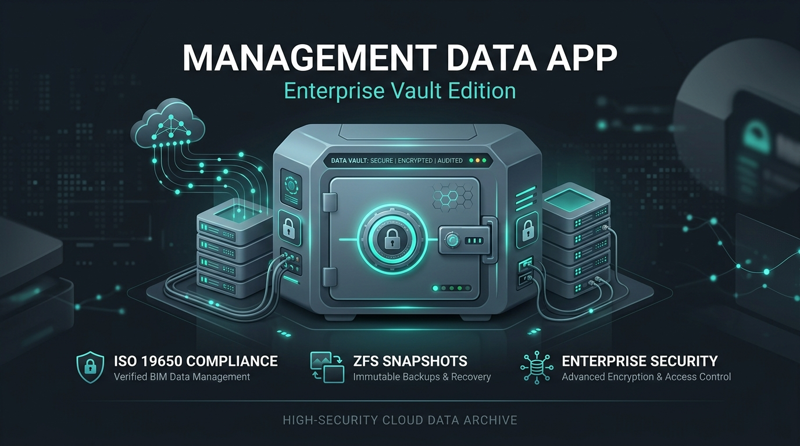
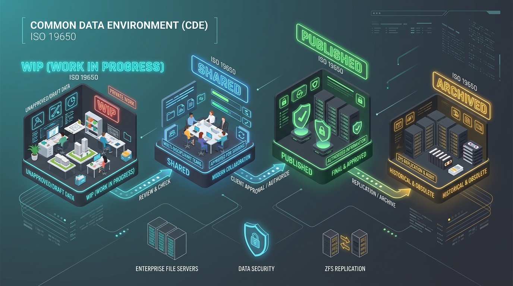

# 🌟 Management Data App (Enterprise Vault Edition)

<p align="center">
  
</p>

Sistem Keamanan, Integrasi Server Storage, dan Manajemen Data Common Data Environment (CDE) Berstandar Internasional **ISO 19650** untuk Kantor Konsultan Arsitektur.

Aplikasi ini dirancang sebagai pelengkap bernilai tambah tinggi (*premium add-on*) untuk dipasang berdampingan dengan sistem operasi **TrueNAS SCALE** guna mengamankan, mengelola, dan mengotomatisasi seluruh struktur berkas arsitektur, gambar kerja AutoCAD, dan model 3D SketchUp/Revit.

---

## 🛡️ Modul Pengamanan Source Code & Anti-Duplikasi (Torky Security Engine)
*Untuk menjamin bisnis Anda sebagai pengelola sistem server di kantor arsitek klien, software ini dipersenjatai perlindungan hak milik tingkat militer:*

* **Hardware-Locked License Key**: Sistem wajib diaktivasi dengan Kunci Lisensi Kriptografis dari Torky Komputer (`TORKY-SECURE-2026-MDA`) yang terkunci pada Sidik Jari Perangkat Keras (Hardware Fingerprint) server target.
* **Source Code Anti-Duplication Hash**: Setiap pod container terisolasi secara kriptografis. Modul deteksi anti-tamper akan memutus akses database secara instan apabila mendeteksi adanya modifikasi liar atau upaya penyalinan mentah source code aplikasi.
* **Server-Side API Encryption & Hiding**: Seluruh logic utama, termasuk integrasi kecerdasan buatan Gemini AI, diproteksi di sisi server (Express API Proxy). API key tidak akan pernah bocor ke browser komputer klien desainer.

---

## 🌟 Fitur Utama & Keunggulan Enterprise

### 📁 1. Common Data Environment (CDE) ISO 19650

<p align="center">
  
</p>

* **Automated Folder Generator**: Menginisialisasi 4 direktori kepatuhan utama (**WIP, SHARED, PUBLISHED, ARCHIVED**) secara otomatis pada ZFS Dataset proyek.
* **ISO 19650 Filename Builder**: Asisten pembuatan kode nama berkas otomatis yang menjamin keunikan dan kepatuhan standar penamaan internasional (Proyek-Originator-Volume-Level-Tipe-Role-Nomor-Kesesuaian-Revisi).
* **AutoCAD Xref Pathing Manager**: Menyinkronkan dan memandu pembacaan referensi silang AutoCAD (Xref) secara relatif (`Relative Path`) maupun tersentralisasi di server.

### 💾 2. Integrasi TrueNAS SCALE & Samba Share (RBAC)
* **Pemetaan 3 Datasheet**: Mengontrol dan memonitor kondisi 3 Samba Share utama kantor: `/admin`, `/projects`, dan `/library`.
* **Sistem Otorisasi Ketat (Role-Based Access Control)**:
  * **Komputer Admin Kantor (Owner/PM)**: Akses **BACA & TULIS (EDIT)** ke ketiga datasheet (`admin`, `projects`, `library`) untuk mengontrol kontrak finansial, SDM, dan master template.
  * **Komputer Desainer (Design Team)**: Akses **BACA & TULIS (EDIT)** dibatasi hanya pada `/projects` dan `/library`. Akses ke folder `/admin` **DIBLOKIR TOTAL** secara sistemik.

### 🚨 3. Proteksi Ransomware & Integritas File
* **ZFS Snapshot Scheduler**: Panduan otomatisasi pembuatan cadangan data berkala (*snapshot*) di TrueNAS SCALE yang tahan terhadap infeksi malware/ransomware.
* **SHA-256 Checksum Validator**: Memindai integritas berkas digital proyek untuk memastikan gambar kerja tidak diubah secara ilegal tanpa persetujuan tim leader.

---

## 🛠️ Panduan Lengkap Instalasi & Deployment pada TrueNAS SCALE
*Aplikasi ini dirancang khusus untuk berjalan di dalam lingkungan kontainer Docker di server **TrueNAS SCALE**.*

### Prasyarat System
* **TrueNAS SCALE** (Versi Bluefin atau Cobia).
* **Dataset ZFS** yang telah terkonfigurasi untuk Samba (SMB) Share: `/admin`, `/projects`, `/library`.
* **Kunci API Gemini** (dari Google AI Studio) untuk mengaktifkan modul AI Recruitment Sandbox.

---

### Bagian 1: Konfigurasi Dataset & User SMB di TrueNAS SCALE

Sebelum menyebarkan aplikasi, Anda wajib mengonfigurasi struktur akun pengguna dan hak akses dataset pada Web UI TrueNAS SCALE:

1. **Membuat Dataset ZFS**:
   * Buka menu **Datasets** di TrueNAS SCALE.
   * Pada pool penyimpanan Anda (misal: `ArchPoolNAS`), buatlah tiga dataset:
     * `admin`
     * `projects`
     * `library`
2. **Membuat User Group (Credentials > Local Users & Groups)**:
   * Buat grup bernama `admin_group` (untuk Komputer Admin/Manajer).
   * Buat grup bernama `design_group` (untuk Komputer Tim Desainer/Arsitek).
3. **Mengatur Izin Akses (ACL)**:
   * Pada Dataset `admin`: Berikan hak akses penuh hanya kepada grup `admin_group`. Pastikan grup `design_group` **tidak memiliki izin sama sekali (Akses Diblokir)**.
   * Pada Dataset `projects` dan `library`: Berikan hak akses penuh (Read/Write) untuk grup `admin_group` maupun `design_group`.

---

### Bagian 2: Deployment Kontainer Aplikasi (Docker Container)

Aplikasi web full-stack ini dapat dikompilasi menjadi kontainer mandiri dan dijalankan secara native di TrueNAS SCALE:

1. **Masuk ke Menu Apps**:
   * Di panel kiri Web UI TrueNAS SCALE, klik **Apps**.
   * Klik tombol **Discover Apps** di pojok kanan atas, lalu pilih **Custom App** (Launch Docker Image).
2. **Konfigurasikan Detail Aplikasi**:
   * **Application Name:** `data-architect-mda`
   * **Container Image:** `torkykomputer/mda-vault` (atau alamat image privat Anda setelah dikompilasi)
   * **Container Port:** `3000`
   * **Port Forwarding (Host Port):** Masukkan `80` (sangat direkomendasikan agar aplikasi dapat diakses langsung melalui alamat IP tanpa tambahan port `:3000`, atau port kosong lainnya sesuai kebijakan IT kantor Anda).
3. **Konfigurasikan Environment Variables (Variabel Lingkungan)**:
   * Tambahkan key: `GEMINI_API_KEY` -> Value: `AIzaSy...` (Kunci API Google AI Studio Anda).
   * Tambahkan key: `NODE_ENV` -> Value: `production`.
4. **Alokasikan Sumber Daya & Simpan**:
   * Atur alokasi CPU dan RAM (aplikasi ini sangat ringan, cukup alokasikan 0.5 vCPU dan 512MB RAM).
   * Klik **Save** dan tunggu status kontainer berubah dari *Deploying* menjadi **Active (Running)**.

---

### Bagian 3: Akses Aplikasi dari Komputer Klien Windows/macOS

Aplikasi ini dapat diakses secara bersamaan oleh seluruh komputer di kantor tanpa perlu menginstal program tambahan apa pun pada PC lokal:

1. Buka browser web (Google Chrome, Microsoft Edge, atau Safari).
2. Ketik alamat IP TrueNAS SCALE kantor Anda (masing-masing kantor memiliki alamat IP tersendiri, misalnya `192.168.1.254`):
   ```
   http://[IP_SERVER_TRUENAS]
   ```
   *Contoh:* `http://192.168.1.254` (Ketik alamat IP langsung di browser tanpa port `:3000` tambahan jika Anda memetakan Port Forwarding Host ke port `80`).
3. Masuk menggunakan akun root admin atau akun desainer sesuai daftar akun penguji yang tersedia.

---

## 💻 Panduan Pengembangan & Kompilasi (Bagi Pemilik Software)

Jika Anda ingin memodifikasi kode sumber atau memperbarui aplikasi sebelum mengunggahnya ke server klien, ikuti langkah-langkah di bawah ini:

### Struktur Berkas Utama
```
├── src/
│   ├── App.tsx          # Berkas utama aplikasi (Dashboard, Projects, Manual, dll)
│   ├── i18n.ts          # Kamus kamus bahasa terjemahan (ID/EN)
│   ├── main.tsx         # Entry point aplikasi React client
│   └── index.css        # Konfigurasi Tailwind CSS global
├── server.ts            # Kode Express Backend server (API Proxy, Gemini API, Middleware)
├── package.json         # Dependensi dan skrip kompilasi
└── auto_push.bat        # Skrip otomatisasi Git push milik Anda
```

### 1. Jalankan Mode Pengembangan Lokal (Development)
```bash
# Install dependensi
npm install

# Jalankan server lokal
npm run dev
```
Aplikasi akan aktif di `http://localhost:3000`.

### 2. Kompilasi untuk Produksi (Production Build)
Skrip build bawaan akan mengompilasi front-end React menggunakan Vite, dan membundel backend Express TypeScript menjadi satu berkas CJS yang terobfuskasi menggunakan `esbuild`:
```bash
npm run build
```
Berkas kompilasi akhir akan tersimpan dengan aman di folder `/dist`.

### 3. Otomatisasi Git Push
Gunakan skrip `auto_push.bat` yang telah kami sediakan untuk mengirimkan setiap perubahan kode terbaru ke repositori Git privat Anda secara instan hanya dengan sekali klik ganda.

### 🔑 4. Generator Lisensi Offline Mandiri (Torky Keygen Suite)
Untuk alasan keamanan siber yang mutlak, generator kode lisensi telah **dihapus seutuhnya dari aplikasi klien** untuk mengeliminasi potensi cracking, hacking, dekripsi ilegal, serta injeksi malware/ransomware. 

Sebagai gantinya, kami menyediakan alat generator lisensi offline berbasis CLI khusus untuk Anda sebagai pemilik software, yang tersimpan aman di dalam repositori privat ini (`/keygen.js`). Anda dapat menjalankannya di komputer mana saja secara offline hanya dengan mengunduh repositori ini.

**Cara Menjalankan Generator Lisensi Offline:**
1. Pastikan Anda sudah berada di direktori root project.
2. Jalankan perintah berikut di Terminal / Command Prompt Anda:
   ```bash
   npm run keygen
   ```
3. Alat interaktif berwarna akan muncul. Anda memiliki 2 opsi mudah:
   * **Opsi 1 (Sangat Direkomendasikan):** Cukup masukkan **ID MESIN KLIEN** yang dikirimkan oleh klien Anda dari form registrasi awal aplikasi untuk mendapatkan kode lisensi aktivasi instan yang valid.
   * **Opsi 2:** Masukkan parameter server klien secara manual (Nama Kantor, IP TrueNAS, dan Nama ZFS Pool) untuk membuat ID Mesin sekaligus Kunci Lisensi baru dari nol.

---

## 📄 Buku Panduan Manual & Cetak PDF

Aplikasi ini dilengkapi dengan **Buku Manual Arsitek** terperinci di dalamnya. Pengguna/pelanggan Anda dapat mencetak buku manual ini kapan saja menjadi dokumen cetak fisik berlogo Torky Komputer:
1. Masuk ke aplikasi dan buka tab **Buku Manual**.
2. Klik tombol **Cetak Buku Manual (PDF)** di kanan atas.
3. Layout otomatis dikonfigurasi menggunakan Tailwind `@media print` sehingga menghasilkan dokumen PDF yang rapi, bersih dari elemen navigasi, dan siap dijadikan lampiran serah terima pekerjaan server.

---

*Keamanan, Kerapian, dan Efisiensi Manajemen Data adalah Kunci Keberhasilan Konstruksi Berkelas Dunia.*  
**Developed by Torky Komputer Security Engine &copy; 2026.**
